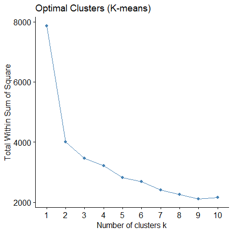
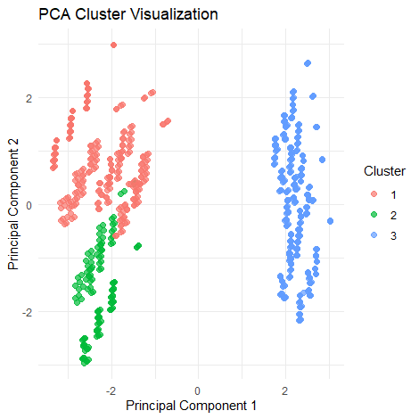
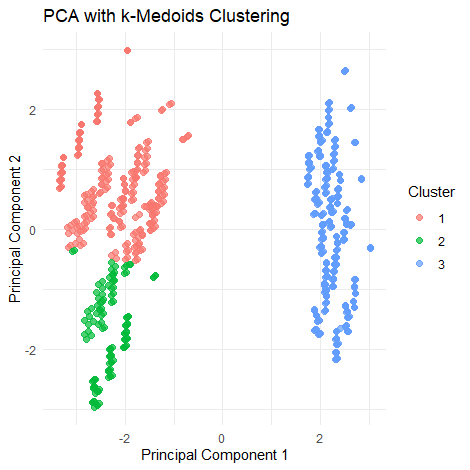
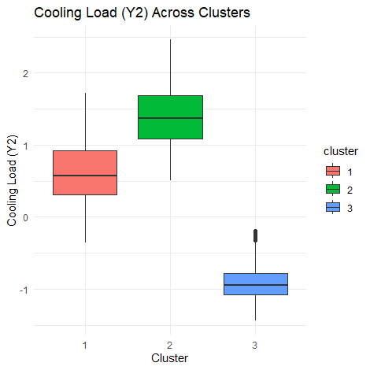

# Building-Energy-Efficiency-Optimization

The dataset Energy Efficiency is designed for energy analysis of buildings simulated in
Ecotect. It includes simulated data for 12 different building shapes. The features capture
various structural and design parameters, while the targets represent energy-related metrics.
Overall Description:
The data contains 768 observations with 8 features describing the building parameters and 2
continuous targets representing energy loads (heating and cooling). The dataset could be
used for regression analysis (predicting heating and cooling loads) or multi-class
classification (if the targets are rounded to integers).
Features Breakdown:
1. Continuous Features (6):
 X1: Relative Compactness
 X2: Surface Area
 X3: Wall Area
 X4: Roof Area
 X5: Overall Height
 X7: Glazing Area
2. Integer Features (2):
 X6: Orientation (Categorical represented as integers)
 X8: Glazing Area Distribution (Categorical represented as integers)
(ii)Where it comes from
The data originates from simulations run in Ecotect, a building energy performance analysis
software. The simulations capture how building characteristics such as glazing area,
orientation, and structural dimensions impact energy demands.The data is extracted from
website: “ https://archive.ics.uci.edu/dataset/242/energy+efficiency”.

Before performing cluster visualization of the data, it is essential to do the visualizations
which are interpretable while reducing it’s dimensionality. Thus Principal Component
Analysis is performed on the data. The variance explained by each Principal Component can
be obtained from following visual :

Thus there are three principal components with significant insight into data.
The means to decide the k value for the data is visualized below:

Thus k-means is performed with k= 3, as there is sudden decrease in rate of decrement of
within sum of square after k = 3. Thus k = 3 is chosen as elbow point.

# The K- means Clustering :
The PCA with K- means Cluster Visualization for k=3 :

# The K- medoids Clustering :
The PCA with K- medoids Cluster Visualization for k=3 :

# The DBSCAN Clustering :
The PCA with Density Based Cluster Visualization : (eps = 1, minPts = 5)

The K-means and K-medoids methods were effective with three clusters but the Density
based clustering reduced the number of clusters to two, when compared to clusters of Kmeans,
it is evident that two clusters which were apparently closer were combined into one
cluster in the Density Based clustering thus resulting only in two clusters.

# Analysis of clusters and drawing insights:
The provided PCA cluster visualization for K- means reveals how the data points are
distributed across the first two principal components (PC1 and PC2), colored by cluster
labels.
1. Well-Separated Clusters
 Cluster 1 (red) is located on the far left, with negative values for PC1 and mostly
higher values for PC2.
 Cluster 2 (green) is on the far left, with negative PC1 values and negative values of
PC2.
 Cluster 3 (blue) is on the far right of the other clusters, with positive PC1 values and
spread widely across PC2 .
This clear separation indicates that the first two principal components capture most of the
variance and provide meaningful distinctions between the clusters.
2. Principal Component Contributions
 PC1 (horizontal axis): The spread of the clusters along PC1 suggests that this
component captures a significant amount of variance in the data. Features with high
loadings on PC1 are likely critical for differentiating Cluster 3 from Cluster 1 and 2.
 PC2 (vertical axis): The vertical spread (along PC2) primarily separates Cluster 2
from the Cluster 1. This indicates that PC2 highlights a variance dimension specific to
Cluster 2.
3. Cluster Characteristics
 Cluster 1 (red): Intermediate PC1 values and distinct PC2 values. This cluster may
correspond to buildings with balanced energy characteristics (e.g., moderate heating
and cooling loads).
 Cluster 2 (green): Likely characterized by low scores for features contributing to
PC1. These points may represent buildings with lower compactness, smaller surface
areas, or specific glazing/energy patterns.
 Cluster 3 (blue): High PC1 values. These buildings might have larger surface areas,
higher compactness, or unique energy demands.
4. Outliers
There are no significant outliers visible in this plot, as all points are clustered around their
respective groups with no distant points.
7
To further understand the clusters , there is a need to understand the relationship between
features and principal components, which can be visualized below:

The PCA Loadings Plot displays how each feature contributes to the first two principal
components (PC1 and PC2).
1. PC1 Contributions
 X1 (Relative Compactness), X3 (Wall Area), X5 (Overall height): Strong negative
contribution to PC1.
 X2 (Surface Area) and X4 (Roof Area): Strong positive contributions to PC1.
This suggests that PC1 captures a trade-off between wall area (negatively correlated) and
surface/roof area (positively correlated).
2. PC2 Contributions
 X1 (Relative Compactness): Dominates PC2 with a strong positive loading.
 X3 (Wall Area), X2(Surface Area), X7(Glazing Area): Moderate negative
contribution to PC2.
This indicates that PC2 reflects a contrast between relative compactness and heating load.
Buildings with higher compactness likely have lower heating loads.

3. Combined Insights
 Features like X3 (Wall Area) and X2 (Surface Area) dominate PC1, which explains
much of the horizontal spread in the PCA cluster visualization.
 X1 (Relative Compactness) drives PC2, contributing to the vertical separation,
particularly distinguishing Cluster 2 from the others.
4. Targets (Y1, Y2)
 Y1 (Heating Load) has a notable negative loading on PC2, suggesting it is inversely
related to relative compactness (X1). Buildings with higher compactness tend to
require less heating energy.
 Y2 (Cooling Load) does not appear prominently in PC1 or PC2, meaning it likely
contributes to later components.
The distribution of clusters across Heating Load can be visualized as follows:

The distribution of clusters across Cooling Load can be visualized as follows:

# Conclusions & Recommendations:
From above visualizations the green cluster has the most inefficient energy consumption
while the blue cluster has most effective energy consumption. The red cluster has moderate
energy consumption observations which is due to high Relative Compactness scores
compared to that of green cluster.
The close proximity of red and green clusters in the box plots for distribution of clusters
across Heating and Cooling Load indicates the decision of Density Based Cluster plot to have
only two clusters.
Design Strategies:
 Focus on optimizing compactness (X1) and wall/roof areas (X3, X4) to balance
energy loads.
 Analyze the trade-off between surface area (X2) and energy efficiency.
Energy Insights:
 Cluster differences in PCA space can be tied to energy loads. Buildings in clusters
with high X1 (compactness) likely require less heating energy.
Targeted Optimization:
 Features like X3 (Wall Area) have a significant negative effect on PC1, indicating
that reducing wall area might improve energy efficiency.
